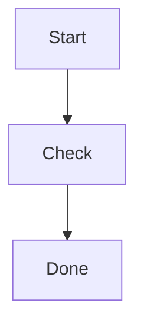

# Mermaid диаграммы в Markdown web UI

## Контекст

В web UI opencode ответы модели отображаются как Markdown. Сейчас fenced code block с языком `mermaid` выглядит как обычный блок кода:

````markdown

````

Это неудобно, потому что модель часто может описать архитектуру, flow или sequence diagram в Mermaid, но браузер показывает только текст исходника.

Мы нашли upstream PR `#21497 feat(ui): add Mermaid diagram visualization in markdown`, но переносить его как есть нельзя: он слишком сложный, устарел относительно текущей структуры repo и содержит риски для streaming, cleanup, concurrent render и theme.

## Что делаем

Делаем минимальную и надежную версию:

- если Markdown block полностью завершен и его язык похож на Mermaid, рендерим его стандартной библиотекой `mermaid`;
- если Mermaid рендерится успешно, показываем SVG-диаграмму;
- если Mermaid падает с ошибкой, показываем текст исключения и исходный код диаграммы;
- во время streaming незавершенный block остается обычным code block;
- не добавляем zoom, pan, fullscreen, download и прочие сложные controls.

## Поддерживаемые языки code fence

Минимально нужны:

```text
mermaid
mmd
```

`graphmermaid` важен из-за пользовательского правила: диаграммы должны быть совместимы с graphmermaid version 9.2.2.

## Что не делаем в MVP

- Не делаем interactive zoom/pan.
- Не делаем fullscreen.
- Не делаем download SVG/PNG/MMD.
- Не пытаемся рендерить незавершенный streaming block.
- Не добавляем поддержку PlantUML, Graphviz/DOT, D2 или других DSL.

## Ожидаемый результат

Пользователь пишет или получает ответ модели:

````markdown

````

В web UI после завершения блока будет видна Mermaid SVG-диаграмма.

Если код диаграммы невалидный, UI должен показать понятную ошибку Mermaid и сохранить исходник, чтобы его можно было исправить или скопировать.
